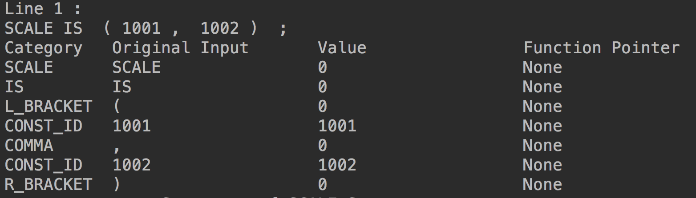
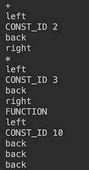
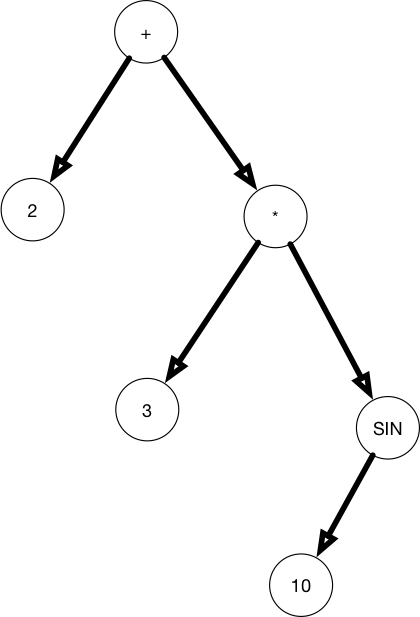
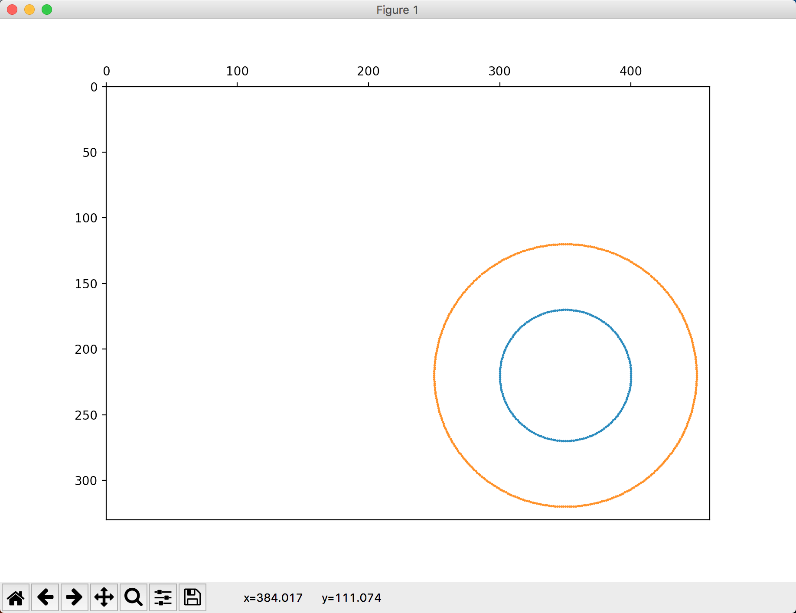

# 简介

使用Python实现的简单函数绘图语言的解释器。

支持的语句包含四类，分别是：

* 循环绘图语句 FOR-DRAW

  语法：`FOR T FROM 起点 TO 终点 STEP 步长 DRAW(横坐标,纵坐标);`

  语义：令T从起点到终点，每次改变一个步长，绘制出由(横坐标，纵坐标)所规定的点的轨迹。

  举例：`FOR T FROM 0 TO 2*PI STEP PI/50 DRAW(COS(T),SIN(T));`

  说明：绘制一个原点在(0,0)的单位圆

* 比例设置语句 SCALE

  语法：`SCALE IS (横坐标比例因子,纵坐标比例因子);`

  语义：设置横纵坐标的比例，并分别按照比例因子进行变化。

  举例：`SCALE IS (100,100);`

  说明：将横纵坐标的比例设置为1:1，并且放大100倍。

* 坐标平移语句 ORIGIN

  语法：`ORIGIN IS (横坐标,纵坐标);`

  语义：将坐标系的原点平移到横坐标和纵坐标规定的点处。

  举例：`ORIGIN IS (360,240);`

  说明：将原点从(0,0)平移到(360,240)处。

* 角度旋转语句 ROT

  语法：`ROT IS 角度;`

  语义：逆时针旋转角度所规定的弧度值。

  举例：`ROT IS PI/2;`

  说明：逆时针旋转`PI/2`，即逆时针旋转90度。

本解释器分为词法分析、语法分析、语义分析三个部分。其中语法分析使用递归下降子程序的方法实现。

在各个步骤之间都有输出中间结果。词法分析部分的中间结果如下图：



语法分析中表达式求值 `2+3*SIN(10);` 的中间结果：表达式树，如下图：



这里使用了前缀遍历来输出整棵表达式树，其中当进入子节点时添加了进入的方向，返回到上一层时有`back`的信息。这里的输出信息表示的表达式树如下图所示：



最后一部分语义分析的结果实际上就是最终的绘图结果。使用了语法制导翻译实现，在语法分析的过程中添加了语义分析的过程。调用以下命令，可以绘制出对应的图形如下：

```
origin is (350,220);
scale is (50,50);
for t from 0 to 2*pi step pi/100 draw(cos(t),sin(t));
scale is (100,100);
for t from 0 to 2*pi step pi/200 draw(cos(t),sin(t));
```



# 代码

本解释器的代码存放在了code目录下。其中包含的模块：

* `lexical.py` 词法分析器
* `exceptions.py`  自定义异常
* `grammer.py` 语法分析器 + 语义分析器
* `expression.py` 递归下降子程序方法实现的表达式求值
* `code.txt` 存放简单函数绘图语言语句的txt文件

# 程序逻辑

请参见我的博客